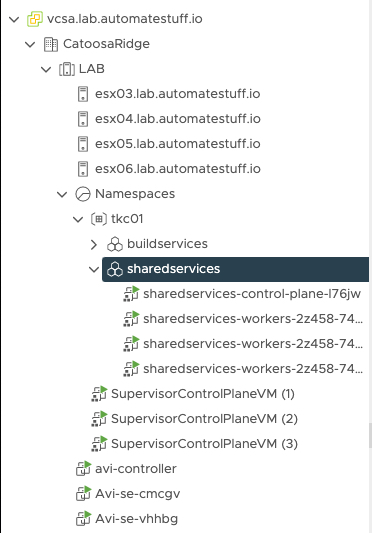

# Readme

## Overview
Deploy a VMware Harbor Container to a Tanzu Kubernetes Cluster (TKC) and configure basic enterprise elements

## Prerequisites
- vSphere 7.0 Update 2 (or newer)
- Workload Management Namespace
    - Example: tkc01
- Kubernetes Cluster
    - Example: sharedservices

## Steps

 0. Ensure that your kubectl session is set to the right context
    - Validate:  kubectl config current context
 1. Configure cluster to use RBAC Authentication
